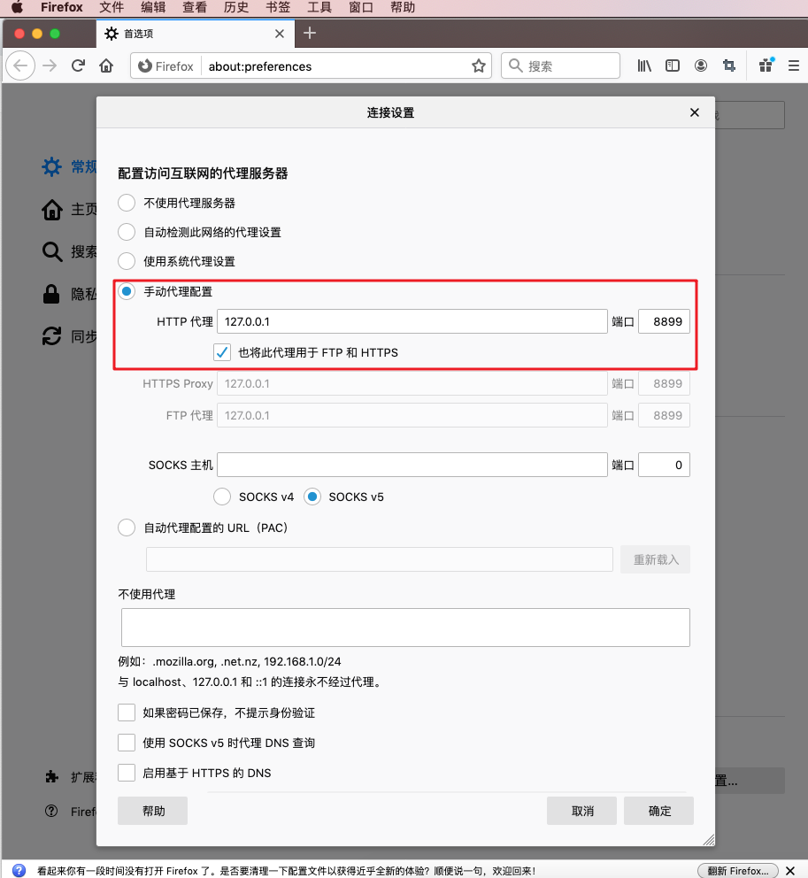
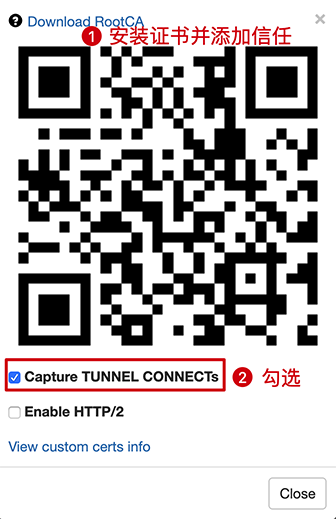

## Whistle 官网

- Whistle 官网：<https://wproxy.org/whistle/>

- Whistle 的 GitHub：<https://github.com/avwo/whistle>


## Whistle 安装启动

### 1、Whistle 安装


（1）通过 npm 安装 Whistle


### 2、启动 whistle

```bash
w2 start
```

然后在浏览器输入`http://127.0.0.1:8899/` 即可打开代理配置的页面。


### 3、配置代理

**chrome浏览器配置代理**：

暂略。

**Firefox浏览器配置代理**：




### 4、安装证书并添加信任：




